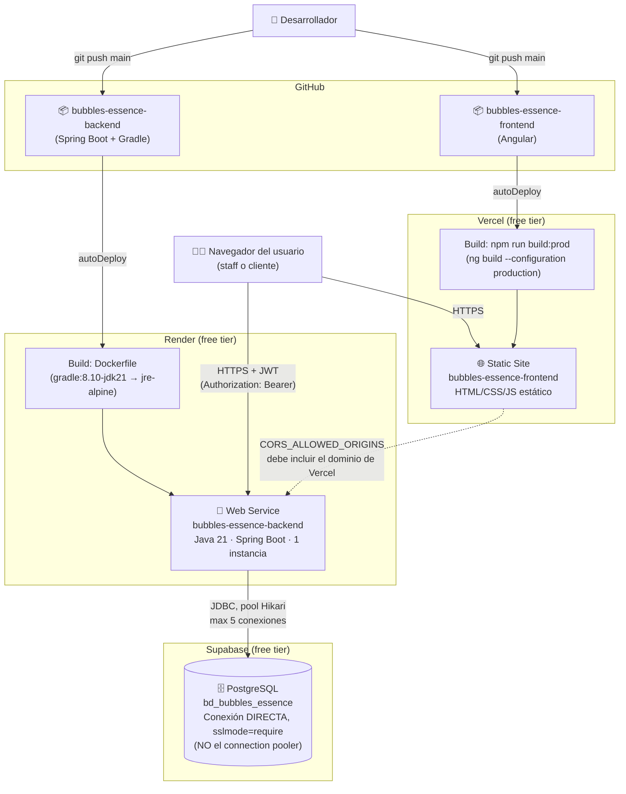

# Arquitectura de despliegue — Bubbles & Essence

Infraestructura real del proyecto: 2 repositorios en GitHub (backend y
frontend), cada uno con su propio pipeline de deploy automático, y una
base de datos compartida en Supabase.

## Variables de entorno por servicio

### Render (backend)
| Variable | Valor / origen |
|---|---|
| `DB_HOST`, `DB_PORT`, `DB_NAME`, `DB_USER`, `DB_PASSWORD` | Supabase → Settings → Database → **Direct connection** (NO el pooler) |
| `JWT_SECRET` | aleatorio, generado una vez (`openssl rand -base64 48`) |
| `JWT_EXPIRATION_MINUTES` | `480` (8h) |
| `API_KEY` | vacío = deshabilitado (acceso máquina-a-máquina, opcional) |
| `CORS_ALLOWED_ORIGINS` | dominio(s) del frontend, separados por coma |
| `PORT` | la inyecta Render automáticamente |

### Vercel (frontend)
No usa variables de entorno en runtime — el `apiUrl` del backend queda
"horneado" en el build vía `environment.prod.ts` (swap automático por
`fileReplacements` en `angular.json`), no se lee en tiempo de ejecución.

## Decisiones de infraestructura (y por qué)

| Decisión | Motivo |
|---|---|
| Backend en Render, no en Vercel | Vercel es serverless (funciones de corta duración); Spring Boot necesita un proceso vivo 24/7 con pool de conexiones persistente a la BD. |
| Conexión **directa** a Supabase, no el pooler | El pooler en modo sesión tiene un límite bajo de clientes concurrentes (`pool_size: 15` en free tier) — ya se agotó una vez en un deploy real. La conexión directa (~60 conexiones) tiene mucho más margen. |
| `maximum-pool-size: 5` en Hikari | Render free = 1 sola instancia corriendo → un solo pool. 5 deja margen bajo el límite de Supabase sin acaparar conexiones. |
| `ddl-auto: none` (no `validate`) | El script SQL usa dominios personalizados (`tddu_activo`, `tddu_monto`...); Hibernate en modo `validate` los compara mal contra el tipo base y siempre marca falso-mismatch. |
| Docker multi-stage (Gradle+JDK para build, JRE solo para runtime) | Imagen final más liviana; no viaja el toolchain de compilación a producción. |
