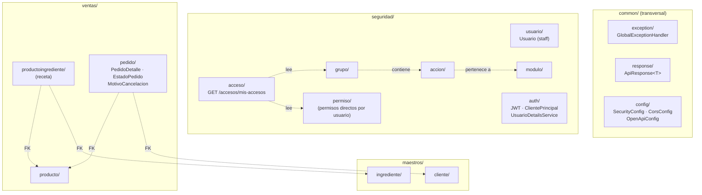
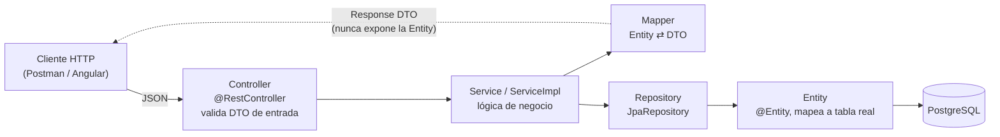
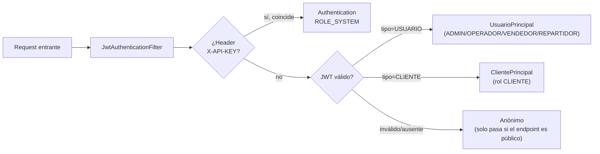

# Estructura del backend — Bubbles & Essence

Spring Boot organizado **por módulo de negocio** (no por capa técnica
plana): cada módulo es autocontenido, con sus propias capas adentro.

## Patrón de capas dentro de cada módulo

Todos los módulos (`producto`, `ingrediente`, `pedido`, `usuario`...)
siguen la misma estructura interna:

Ejemplo real: `ventas/producto/` = `Producto.java` (entity) +
`ProductoRepository.java` + `ProductoService.java` (interfaz) +
`ProductoServiceImpl.java` + `ProductoMapper.java` +
`ProductoController.java` + `dto/ProductoRequestDTO.java` +
`dto/ProductoResponseDTO.java`.

## Matriz de autorización por endpoint (`@PreAuthorize` real, por módulo)

| Módulo / acción | ADMIN | OPERADOR | VENDEDOR | REPARTIDOR | CLIENTE | Invitado |
|---|:---:|:---:|:---:|:---:|:---:|:---:|
| **Usuarios** (CRUD) | ✅ | ❌ | ❌ | ❌ | ❌ | ❌ |
| **Módulos / Acciones / Grupos** (CRUD) | ✅ | ❌ | ❌ | ❌ | ❌ | ❌ |
| **Permisos directos por usuario** | ✅ | ❌ | ❌ | ❌ | ❌ | ❌ |
| **Ingredientes** (crear/editar/desactivar) | ✅ | ✅ | ❌ | ❌ | ❌ | ❌ |
| **Clientes** (ver/gestionar, admin) | ✅ | ✅ | ✅ | ❌ | ❌ | ❌ |
| **Productos** (crear/editar/desactivar) | ✅ | ✅ | ❌ | ❌ | ❌ | ❌ |
| **Receta producto-ingrediente** (CRUD) | ✅ | ✅ | ❌ | ❌ | ❌ | ❌ |
| **Pedidos**: listar / ver detalle | ✅ | ✅ | ✅ | ❌ | ❌ | ❌ |
| **Pedidos**: confirmar/rechazar pago, cambiar estado, cancelar (admin) | ✅ | ✅ | ❌ | ❌ | ❌ | ❌ |
| **Pedidos**: crear pedido | — | — | — | — | ✅ | ✅ |
| **Pedidos**: ver "mis pedidos" | ❌ | ❌ | ❌ | ❌ | ✅ | ❌ |
| **Pedidos**: seguimiento por código + cancelar (invitado) | — | — | — | — | — | ✅ |

> **Nota**: el rol `REPARTIDOR` existe en el enum `RolUsuario` pero **no
> tiene ningún endpoint asignado todavía** — queda pendiente de diseñar
> cuando se construya el flujo de entregas (ver sección "Qué falta" del
> README del backend).

## Seguridad dual: dos tipos de token, un solo filtro

