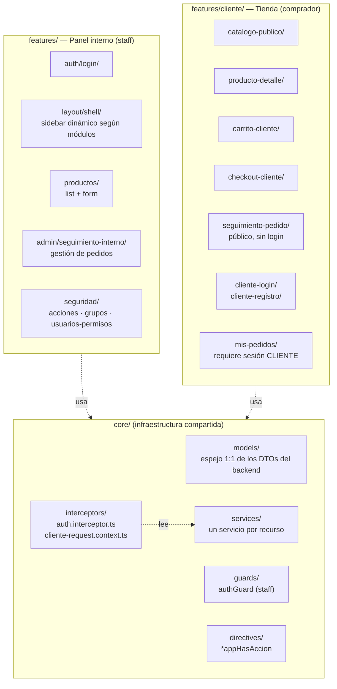
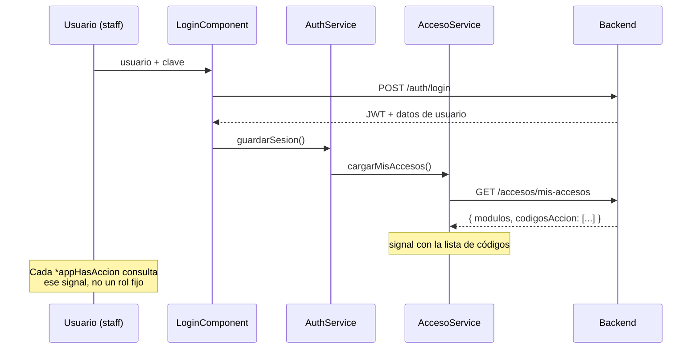

# Estructura del frontend — Bubbles & Essence

Angular con dos zonas separadas (panel interno de staff y tienda de
cliente), compartiendo la infraestructura de `core/`.

## Las dos sesiones conviviendo en el mismo navegador

```mermaid
flowchart TB
    LS[("localStorage")]
    SessStaff["be_session\n(token tipo USUARIO)"]
    SessCliente["be_session_cliente\n(token tipo CLIENTE)"]
    LS --> SessStaff
    LS --> SessCliente

    Req["Angular hace un HttpRequest"] --> Mark{"¿El servicio marcó\nUSA_TOKEN_CLIENTE\nen el HttpContext?"}
    Mark -- "sí" --> UseCliente["Usa be_session_cliente"]
    Mark -- "no (default)" --> UseStaff["Usa be_session"]

    style Mark fill:#2d2d6b
```

**Por qué por `HttpContext` y no por URL**: varios endpoints de cliente
comparten la misma ruta base que endpoints de staff (ej.
`/api/v1/pedidos/mis-pedidos` vs `/api/v1/pedidos` para el staff), así
que "la URL contiene `/cliente/`" no es una señal confiable — se probó y
causó un 403 real en producción. Cada servicio Angular que llama un
endpoint con `@PreAuthorize("hasRole('CLIENTE')")` en el backend debe
marcarlo explícitamente (ver `pedido-cliente.service.ts →
obtenerMisPedidos()` como ejemplo).

## `*appHasAccion`: cómo se decide qué botón se ve

## Qué falta en el frontend
- UI de gestión de **clientes** en el panel interno (el backend ya expone
  el CRUD).
- Paginación en catálogo y lista de pedidos si crecen mucho.
- Redirección automática a `/cliente/login` cuando expira la sesión de
  cliente (hoy solo limpia el `localStorage`, sin redirect).
- Pantallas para el rol `REPARTIDOR` (depende de que el backend primero
  defina esos endpoints — ver nota en `02-estructura-backend.md`).
