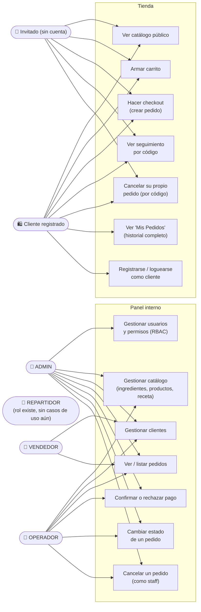
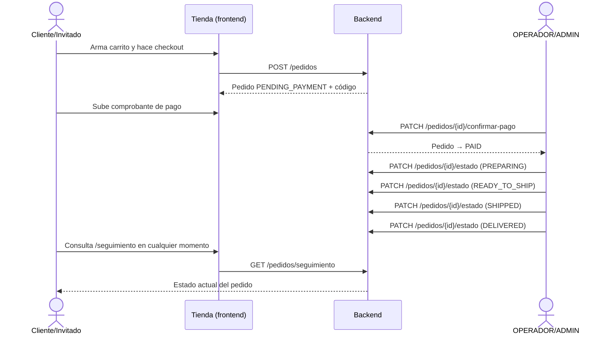

# Usuarios y casos de uso — Bubbles & Essence

6 tipos de actor: 4 roles de staff (tabla `tbl_seg_usuario`), clientes
registrados, e invitados sin cuenta.

## Diferencia clave: Invitado vs Cliente registrado

| Capacidad | Invitado | Cliente registrado |
|---|:---:|:---:|
| Ver catálogo, armar carrito, hacer checkout | ✅ | ✅ |
| Seguimiento de pedido por código + documento | ✅ | ✅ |
| Cancelar un pedido propio (vía código) | ✅ | ✅ |
| Ver historial completo ("Mis Pedidos") | ❌ | ✅ |
| Pedido queda asociado a una cuenta | ❌ | ✅ |

Ningún caso de uso de compra (ver catálogo, comprar, hacer seguimiento,
cancelar) **requiere** cuenta — la cuenta de cliente solo **suma**
historial y conveniencia, nunca es un bloqueo para comprar.

## Flujo completo de un pedido (todos los actores que tocan el estado)

## Pendiente de este diagrama
Falta mapear el flujo de **REPARTIDOR** (entrega física) en cuanto el
backend defina esos endpoints — hoy el estado `SHIPPED`→`DELIVERED` lo
cambia OPERADOR/ADMIN manualmente, no hay actor de reparto todavía.
